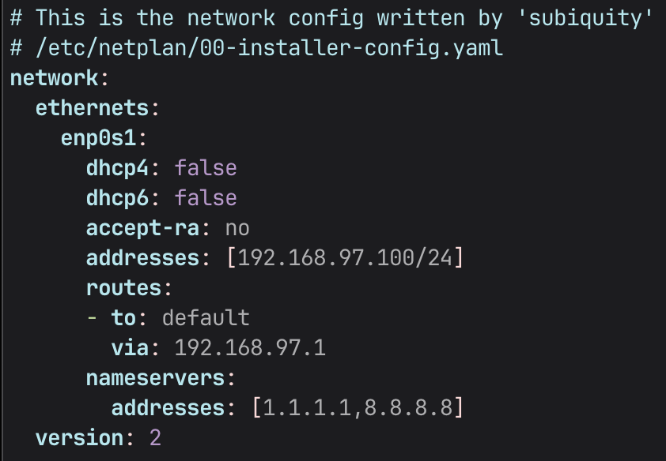
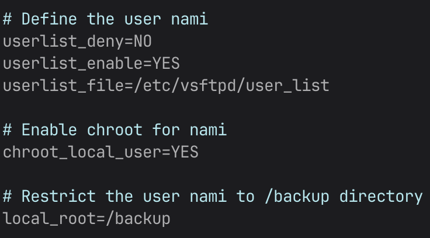

# deep-in-system

Table of contents:

- [The VM Part](#the-vm-part)
- [The Network Part](#the-network-part)
- [The Security Part](#the-security-part)
- [The User Management Part](#the-user-management-part)
  - [luffy](#luffy)
  - [zoro](#zoro)
- [The Services Part](#the-services-part)
- [The Database Part](#the-database-part)
- [The WordPress Part](#the-wordpress-part)
- [The Backup Part](#the-backup-part)
- [The Bonus Part](#the-bonus-part)

## The VM Part

> - The VM disk size must be 30GB.
>
> - You must divide your VM disk into these partitions: swap: 4G /: 15G /home: 5G /backup: 6G
>
> - Your username must be your login name.
>
> - You have to set your hostname with the format of {username}-host, if your login is potato, then your hostname must be potato-host.


_current partitions for Mac OS_

## The Network Part

1.  Run `./configure_netplan.sh` to create a new netplan with the given default gateway
    

2.  Run `./configure_ufw.sh` to enable the firewall and add rules for port 20, 21, 80, 443 and 2222

## The Security Part

Run `./configure_ssh.sh` to configure `/etc/ssh/sshd_config`. These lines will be changed to following:

```
# New port
Port 2222

# Disable root login
PermitRootLogin no

# Enable public ssh key authentication
PubkeyAuthentication yes
```

## The User Management Part

### luffy

_In the VM:_

- `sudo adduser luffy`

- `sudo usermod -aG sudo luffy`
  > This will create the user luffy and add it to the sudoers group

_In the host machine, run the provided script in `/scripts`:_

- `./create_ssh_key.sh`
  > This will create the ssh key and add it to the user

### zoro

- `sudo adduser zoro`
  > This will create the user zoro

## The Services Part

1. Download vsftpd: `sudo apt install vsftpd`

2. Add the /nologin shell to available shells

   `add-shell /sbin/nologin`

3. Add user nami
   `sudo adduser nami`

4. Change shell to /nologin
   `sudo chsh nami /sbin/nologin`

5. Add these settings to lock nami to /backup

   
   _FTP configuration for nami_

6. Restart vsftpd to apply changes `sudo systemctl restart vsftpd`

## The Database Part

1. Install mysql

   `sudo apt install mysql-server`

2. Delete remote access to the root user

   `sudo mysql -u root`

   _Inside the mysql shell, run these queries:_

   ```sql
   DELETE FROM mysql.user WHERE User='root' AND Host NOT IN ('localhost', '127.0.0.1', '::1');

   FLUSH PRIVILEGES;
   ```

   > This will disable remote root access to the database

3. Create the wordpress DB

   ```sql
      CREATE DATABASE wordpress;
   ```

4. Create the wordpress user

   ```sql
   CREATE USER 'wordpressuser'@'localhost' IDENTIFIED BY 'wordpress_password_here';

   GRANT ALL PRIVILEGES ON wordpress.* TO 'wordpressuser'@'localhost';

   FLUSH PRIVILEGES;
   ```

   > This will create the wordpress user with all privileges on all tables in the wordpress DB

5. Give the user process privileges

   ```sql
      GRANT PROCESS ON *.* TO wordpressuser@localhost;
      FLUSH PRIVILEGES;
   ```

   > This will grant all processing privileges to the wordpress user. This is needed to backup the DB.

6. Disallow connections to MySQL from outside the server

   - `sudo vim /etc/mysql/mysql.conf.d/mysqld.conf`
   - Add `skip-networking` under `[mysqld]`
   - Save and exit
     > `skip-hetworking` prohibits MySQL from acceptong network connections

7. Apply all changes
   `sudo systemctl restart mysql`

## The WordPress Part

1. Install all dependencies

```sh
sudo apt update
sudo apt install apache2 \
                 ghostscript \
                 libapache2-mod-php \
                 mysql-server \
                 php \
                 php-bcmath \
                 php-curl \
                 php-imagick \
                 php-intl \
                 php-json \
                 php-mbstring \
                 php-mysql \
                 php-xml \
                 php-zip

```

2. Download the latest version of WordPress and extract it to /srv/www

```sh
sudo mkdir -p /srv/www
sudo chown www-data: /srv/www
curl https://wordpress.org/latest.tar.gz | sudo -u www-data tar zx -C /srv/www
```

3. Configure Apache for WordPress

- Add this wordpress.conf to /etc/apache/sites-available

  ```xml
  <VirtualHost *:80>
      DocumentRoot /srv/www/wordpress
      <Directory /srv/www/wordpress>
          Options FollowSymLinks
          AllowOverride Limit Options FileInfo
          DirectoryIndex index.php
          Require all granted
      </Directory>
      <Directory /srv/www/wordpress/wp-content>
          Options FollowSymLinks
          Require all granted
      </Directory>
  </VirtualHost>
  ```

- Enable WordPress

  `sudo a2ensite wordpress`

- Allow path rewriting

  `sudo a2enmod rewrite`

- Disable the default website

  `sudo a2dissite 000-default`

- Restart apache to apply changes

  `sudo systemctl restart apache2`

- Copy the wordpress configuration

  `sudo -u www-data cp /srv/www/wordpress/wp-config-sample.php /srv/www/wordpress/wp-config.php`

- Set the database credentials in the configuration file

  ```sh
  sudo -u www-data sed -i 's/database_name_here/wordpress/' /srv/www/wordpress/wp-config.php
  sudo -u www-data sed -i 's/username_here/wordpress/' /srv/www/wordpress/wp-config.php
  sudo -u www-data sed -i 's/password_here/<your-password>/' /srv/www/wordpress/wp-config.php
  ```

- Change the keys and salts:

  `sudo -u www-data vim /srv/wordpress/wp-config.php`

  Now replace:

  ```php
  define( 'AUTH_KEY',         'put your unique phrase here' );
  define( 'SECURE_AUTH_KEY',  'put your unique phrase here' );
  define( 'LOGGED_IN_KEY',    'put your unique phrase here' );
  define( 'NONCE_KEY',        'put your unique phrase here' );
  define( 'AUTH_SALT',        'put your unique phrase here' );
  define( 'SECURE_AUTH_SALT', 'put your unique phrase here' );
  define( 'LOGGED_IN_SALT',   'put your unique phrase here' );
  define( 'NONCE_SALT',       'put your unique phrase here' );
  ```

  with the contents of [this](https://api.wordpress.org/secret-key/1.1/salt/)

- Final steps

  In a browser on the host machine, enter the ip address of VM and press return. Follow the instructions and you are ready to go.

## The Backup Part

1. Setting up the cronjob

Set up the cronjob with: `crontab -e`

```elixir
   M H D M D            script:
   0 0 * * * /home/user/wordpress_backup.sh
```

_The contents of the backup script is located inside /scripts/wordpress_backup.sh_

2. Accessing the backup

Use `ftp <host-addr> <port(optional)>` and log in with the nami user.

Download the backup with `get <name-of-backup>`

## Final words

The sha1 checksum is located in `deep-in-system.sha1`
