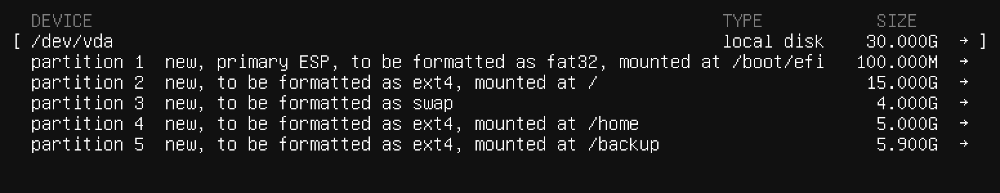

# deep-in-system

Table of contents:

- [The VM Part](#the-vm-part)
- [The Network Part](#the-network-part)
- [The Security Part](#the-security-part)
- [The User Management Part](#the-user-management-part)
- [The Services Part](#the-services-part)
- [The Database Part](#the-database-part)
- [The WordPress Part](#the-wordpress-part)
- [The Backup Part](#the-backup-part)
- [The Bonus Part](#the-bonus-part)

## The VM Part

> - The VM disk size must be 30GB.
>
> - You must divide your VM disk into these partitions: swap: 4G /: 15G /home: 5G /backup: 6G
>
> - Your username must be your login name.
>
> - You have to set your hostname with the format of {username}-host, if your login is potato, then your hostname must be potato-host.


_current partitions for Mac OS_

## The Network Part

1. `sudo vim /etc/netplan/config-file.yaml`
   
   _example config_

2. `sudo netplan apply`

3. `sudo ufw enable`

4. `sudo ufw allow 2222`

## The Security Part

`sudo vim /etc/ssh/sshd_config`

```
Port 2222
PermitRootLogin no
PubkeyAuthentication yes
```

## The User Management Part

`ssh-keygen`

`ssh-copy-id -i /path/to/key.pub -p 2222 luffy@server-ip`

`ssh-add /Users/user/.ssh/keyname.pub`

## The Services Part

`add-shell /sbin/nologin`

`sudo adduser nami`

`sudo chsh nami` `/sbin/nologin`

_FTP configuration for nami_

## The Database Part

`sudo apt install mysql-server`

## The WordPress Part

## The Backup Part

## The Bonus Part
